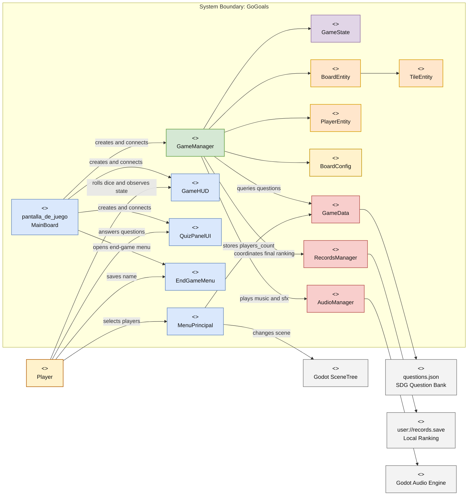
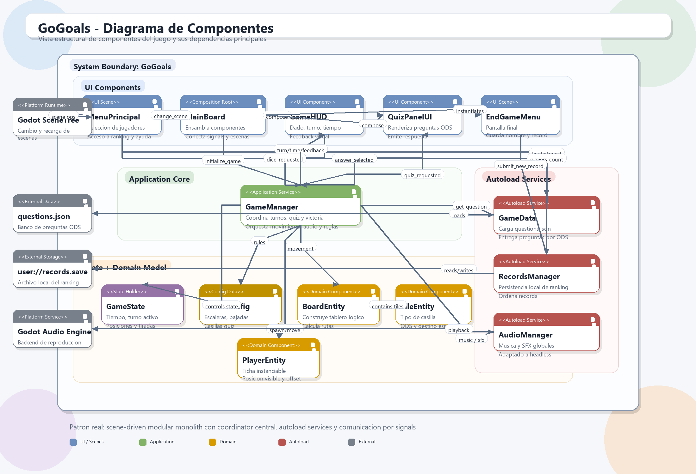

# GoGoals Architecture

This document summarizes the system context, the main game flow, and the architectural pattern that governs the project.

## 1. Executive Summary

The game does not use pure MVC or strict Clean Architecture. The most accurate way to describe it is:

**Hierarchical Node-Based Architecture with global services, lightweight entities, and central application coordination.**

The design is built on four fundamental pillars:

- **Scene-Driven Architecture**: Navigation and UI boundaries rely on Godot's native scene system. The main menu, the interactive game screen, and the end-game menu act as natural presentation boundaries. Within the game, the main level acts as a local composition root, assembling dependencies and connecting the UI with logic without directly mixing their responsibilities.

- **Global Services via Autoloads**: Godot facilitates the Singleton pattern through globally registered nodes, allowing cross-cutting concerns to be accessed from any scene. The project uses `GameData` to maintain game configuration and load the question bank, `AudioManager` to centralize music and sound effect playback, and `RecordsManager` to manage local score persistence in a structured and independent manner.

- **Central Coordination and Event-Driven Communication**: Instead of a strict Model-View-Controller pattern, the game flow is orchestrated by a central application coordinator (`GameManager`). This component concentrates the main use cases: turn control, movement, questions, and victory. To achieve low coupling, communication to the UI is governed by signals (Event Bus). Interfaces like the quiz panel react independently to events without depending on the coordinator's internal code.

- **Separated State Model and Lightweight Entities**: The mutable game state (game phase, current turn, roll count) is isolated in an explicit state model (`GameState`), which facilitates managing pauses or game overs. Additionally, the domain is represented through lightweight interactive entities (board logic, tiles, and tokens) that encapsulate their own behavior but delegate global flow control to the game coordinator.

## 2. Context Diagram

The following diagram is written in Mermaid and organized as a Visual Paradigm-style context diagram: actors outside, system boundary in the center, and external services around.

### Component Diagram (Image)

The following version presents the architecture as a component diagram, with a visual style closer to UML tools like Visual Paradigm.

## 3. Contextual Flow of a Match

### 3.1 System Entry

1. `MenuPrincipal` initiates the interaction.
2. The player selects the number of participants.
3. The value is stored in `GameData.players_count`.
4. The `SceneTree` changes to the `pantalla_de_juego` scene.

### 3.2 Main Scene Assembly

1. `MainBoard` loads as the root of the playable scene.
2. `MainBoard` instantiates `GameManager`.
3. `MainBoard` instantiates `GameHUD`.
4. `MainBoard` instantiates `QuizPanelUI`.
5. `MainBoard` instantiates `PauseMenuUI`.
6. `MainBoard` connects signals between UI and logic.
7. `MainBoard` calls `GameManager.initialize_game(...)`.

### 3.3 Game Initialization

1. `GameManager` creates `BoardEntity`.
2. `BoardEntity` takes the board nodes from the scene and transforms them into `TileEntity` instances.
3. `BoardConfig` provides the fixed board rules:
   - Ladders
   - Slides
   - Quiz tiles
4. `GameState` resets:
   - Time
   - Active player
   - Positions
   - Turn counts
5. `GameManager` instantiates one `PlayerEntity` per player.
6. `AudioManager` starts background music.

### 3.4 Turn Execution

1. `GameHUD` receives the dice button action.
2. `GameHUD` emits `dice_requested`.
3. `MainBoard` forwards the request to `GameManager.roll_dice()`.
4. `GameManager` validates whether the game accepts input.
5. `GameManager` generates the random dice value.
6. `GameState` increments the active player's roll count.
7. `GameManager` emits signals to:
   - Update the HUD
   - Disable input
   - Play SFX
8. `BoardEntity` calculates the complete path.
9. `GameManager` animates the token tile by tile.
10. If movement overshoots the finish, the path bounces backward.

### 3.5 Tile Resolution

When movement finishes, `GameManager` inspects the destination tile:

- **Normal**: Ends the turn.
- **Ladder**: Moves to the destination and re-evaluates.
- **Slide**: Moves to the destination and re-evaluates.
- **Quiz**: Requests a question from `GameData`.
- **Finish**: Marks the game as over.

### 3.6 SDG Quiz

1. `GameData` reads questions from `questions.json`.
2. `GameManager` requests a question based on the ODS associated with the tile.
3. `QuizPanelUI` renders the content.
4. The player answers.
5. `QuizPanelUI` calculates whether the selected option matches `correct`.
6. `GameManager.answer_quiz(...)` resolves the effect:
   - **Correct**: The same player rolls again
   - **Incorrect**: Turn passes to the next player

### 3.7 Game Closure

1. `GameManager` emits `victory`.
2. `MainBoard` instantiates `EndGameMenu`.
3. `EndGameMenu` displays time and turns.
4. `RecordsManager` saves the record to `user://records.save`.
5. The player can:
   - Return to menu
   - Restart the scene
   - Register their name

## 4. Actual Architectural Pattern

### Practical Pattern Name

**Modular monolith scene-driven with autoload services and central signal-based coordination.**

This name better reflects the current implementation than labels like MVC, MVVM, ECS, or Hexagonal.

## 5. Structural Characteristics

### 5.1 Scene-Driven Architecture

- Main navigation depends on Godot's scene system.
- Each scene delimits a distinct UI context.
- `MenuPrincipal`, `pantalla_de_juego`, and `EndGameMenu` are natural screen boundaries.
- The scene remains a composition unit, not just a view.

### 5.2 Local Composition Root

- `MainBoard` creates and connects components but does not decide rules.
- This file serves as the dependency assembly point.
- The main responsibility of `MainBoard` is to wire the flow.
- This reduces coupling between UI and domain logic.

### 5.3 Central Application Coordinator

- `GameManager` concentrates the game's use cases.
- Controls the game lifecycle.
- Orchestrates movement, quiz, turns, victory, and audio.
- Acts as an application service.
- Also the main concentration point for complexity.

### 5.4 Separated State Model

- `GameState` maintains the mutable session state.
- State is no longer scattered across multiple visual nodes.
- This facilitates reset, inspection, and rule testing.
- `GameState` functions as a state holder, not a coordinator.

### 5.5 Lightweight Domain Entities

- `BoardEntity` represents the board structure.
- `TileEntity` represents tile type and metadata.
- `PlayerEntity` represents a token and its visible position.
- These entities contain useful local behavior but do not govern the entire game.

### 5.6 Semi-Data-Driven Configuration

- `BoardConfig` externalizes fixed board rules within a data class.
- `questions.json` externalizes the question bank.
- The board is not fully data-driven because configuration remains in GDScript code.
- Quiz content does follow a more data-oriented approach.

### 5.7 Global Services via Autoload

- `GameData` — question reading and access service.
- `RecordsManager` — centralizes ranking persistence.
- `AudioManager` — centralizes music and effects playback.
- Global singletons accessible from any scene.

## 6. Communication Characteristics

### 6.1 Observer Pattern with Signals

- Component communication uses Godot signals.
- `GameHUD` does not need to know movement internals.
- `QuizPanelUI` does not resolve rules; it only emits the result.
- `GameManager` publishes high-level events:
  - Turn started
  - Dice rolled
  - Feedback requested
  - Quiz requested
  - Victory
- This model reduces direct dependencies between layers.

### 6.2 Low UI-Logic Coupling

- The HUD and quiz panel depend on signal contracts, not on the internal board structure.
- The main logic does not directly write each visual element.
- The UI reacts to events emitted by the application layer.

### 6.3 Moderate Coupling to Global Services

- Although the UI is well decoupled, the application layer does depend on autoloads.
- `GameManager` knows `GameData` and `AudioManager`.
- `EndGameMenu` knows `RecordsManager`.
- This simplifies the project but is not strict dependency inversion.

## 7. Control and State Characteristics

### 7.1 Coordinated Imperative Flow

- Match progression is resolved sequentially.
- The system follows a clear chain:
  - Input → Roll → Movement → Tile Resolution → Quiz or Victory or Turn Change
- No complex scheduler or self-organizing entities.

### 7.2 Lightweight State Machine

- `GameState` uses phases: `MENU`, `PLAYING`, `PAUSED`, and `GAME_OVER`.
- There is no formal state machine with per-state classes.
- Still, the game phase acts as a constraint on valid transitions.

### 7.3 Centralized Turn Control

- The active turn lives in a single place.
- Player rotation is not duplicated across layers.
- Rules for when a player can roll are centralized in `GameManager`.

## 8. Persistence and Data Characteristics

### 8.1 Simple Local Persistence

- Ranking is persisted in a local JSON file.
- No complex repositories or external databases.
- The strategy is sufficient for a small local game.

### 8.2 Embedded Business Rules

- `RecordsManager` applies ranking rules:
  - Fewer turns wins
  - On equal turns, less time wins
- Persistence does not just store data; it also applies domain criteria.

### 8.3 Content Loading Separated from UI Flow

- Questions are not embedded in buttons or labels.
- `GameData` loads them once and serves them to the rest of the system.
- This separates presentation from content.

## 9. Advantages of the Current Pattern

- Strong improvement over the initial monolith.
- More readable responsibilities.
- Better UI component reuse.
- Lower coupling between presentation and rules.
- Easy to understand for small teams working with Godot.
- Compatible with the natural way of building games in scenes.
- Allows continued modularization without rewriting the entire project.

## 10. Limitations of the Current Pattern

- `GameManager` is still a large module.
- Autoloads are practical but create global dependency.
- The board is not yet fully configurable from external data.
- No formal ports/adapters layer or domain interfaces.
- The model remains oriented to Godot's runtime, not to full engine independence.

## 11. What This Architecture Is Not

- **Not pure MVC**: The scene is not just a view; the controller is not classically separated.
- **Not MVVM**: There are no view-models or declarative binding.
- **Not ECS**: Entities are not simple IDs with data components.
- **Not strict Clean Architecture**: There are direct dependencies on Godot and autoloads.
- **Not Event Sourcing**: State is not reconstructed from persisted events.

## 12. Final Assessment

The game's architecture can be summarized as follows:

1. Godot provides the scenes and interaction runtime.
2. `MainBoard` assembles the play use case.
3. `GameManager` coordinates the session.
4. `GameState` holds the mutable state.
5. Entities model the board, tiles, and tokens.
6. The UI reacts via signals.
7. Global services handle data, ranking, and audio.

The result is a modular and maintainable architecture for a small-to-medium game, though still with a strong center in `GameManager`. The natural evolution would be to split that coordinator into smaller turn, movement, and quiz services without losing the scene-driven approach that already fits well with Godot.
