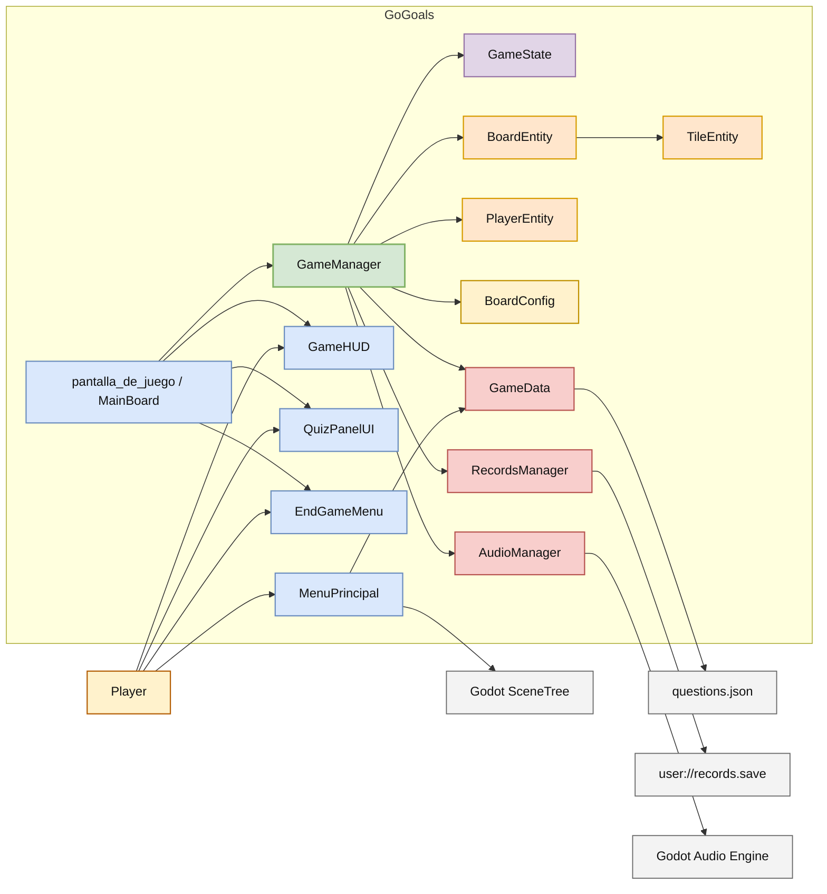

# Architecture

Technical reference for the GoGoals system design. Covers the architectural pattern, component responsibilities, communication model, and design decisions.

---

## 1. Pattern Definition

The project does not follow pure MVC, MVVM, or Clean Architecture. The closest description is:

> **Hierarchical Node-Based Architecture** with global services, lightweight domain entities, and central application coordination via signals.

This is not an arbitrary label. Each part of the name maps to a concrete structural decision:

- **Hierarchical Node-Based**: The Godot scene tree provides the runtime structure. Scenes are both composition units and navigation boundaries.
- **Global Services**: Autoload singletons handle cross-cutting concerns (data, audio, persistence).
- **Lightweight Domain Entities**: `BoardEntity`, `TileEntity`, and `PlayerEntity` encapsulate local behavior without governing the game loop.
- **Central Application Coordination**: `GameManager` owns the use cases and orchestrates the flow.

---

## 2. Design Pillars

### 2.1 Scene-Driven Architecture

Navigation depends on Godot's native scene system. Each scene (`MenuPrincipal`, `pantalla_de_juego`, `EndGameMenu`) acts as a self-contained presentation boundary. The scene is not merely a view — it is a composition unit that assembles its own dependencies.

Within the game scene, `MainBoard` serves as the local **composition root**. It instantiates the coordinator, the HUD, the quiz panel, and the pause menu, then wires their signals together. This keeps presentation assembly separate from domain logic.

### 2.2 Global Services via Autoloads

Three autoload singletons handle concerns that span scene boundaries:

| Service | Responsibility |
|---------|----------------|
| `GameData` | Loads the question bank from JSON at startup. Provides randomized questions per SDG category with cycle-without-repeats logic. |
| `AudioManager` | Manages a persistent music player and ephemeral SFX players. Persists volume settings to disk. |
| `RecordsManager` | Stores and retrieves the top 10 ranking records. Applies sorting criteria (fewer turns first, then less time). |

These services are accessible from any node via `/root/ServiceName`. They simplify wiring but introduce global coupling — a deliberate trade-off for a project of this scale.

### 2.3 Central Coordination and Event-Driven Communication

`GameManager` concentrates the primary use cases: turn management, dice rolling, movement animation, quiz flow, pause/resume, and victory detection. It acts as an application service — not a Godot node that renders anything, but a node that orchestrates everything.

Communication from `GameManager` to the UI layer uses **Godot signals** (Observer pattern). The coordinator emits high-level events:

| Signal | When |
|--------|------|
| `game_initialized` | After board and players are set up |
| `turn_started` | When a player's turn begins |
| `dice_rolled` | After the dice value is generated |
| `movement_started` | When token animation begins |
| `movement_finished` | When token reaches its destination |
| `quiz_requested` | When a quiz tile triggers a question |
| `feedback_requested` | When a status message should appear |
| `victory` | When a player reaches the finish |
| `input_state_changed` | When the dice button should enable/disable |
| `pause_state_changed` | When pause is toggled |

The UI components subscribe to these signals and react independently. They never call game logic directly — they emit their own signals (`dice_requested`, `answer_selected`, `pause_requested`) that `MainBoard` forwards to `GameManager`.

### 2.4 Separated State Model and Lightweight Entities

`GameState` is an explicit state holder that isolates mutable session data:

- Current phase (`MENU`, `PLAYING`, `PAUSED`, `GAME_OVER`)
- Active player index
- Per-player positions and turn counts
- Accumulated game time
- Movement and dice-rolling flags

This separation makes it possible to inspect, reset, or test game state without touching the coordinator or the UI.

Domain entities (`BoardEntity`, `TileEntity`, `PlayerEntity`) are lightweight. They encapsulate local behavior — path calculation, tile classification, position offsets — but do not control the game loop. Flow control is the coordinator's responsibility.

---

## 3. Component Map

```
MainBoard (composition root)
├── GameManager (coordinator)
│   ├── BoardEntity (domain)
│   │   └── TileEntity[] (domain)
│   ├── PlayerEntity[] (domain)
│   ├── GameState (state model)
│   └── BoardConfig (data)
├── GameHUD (ui)
├── QuizPanelUI (ui)
└── PauseMenuUI (ui)

Autoloads (global)
├── GameData
├── AudioManager
└── RecordsManager
```

---

## 4. Context Diagram



A rendered component diagram is available at [`./images/diagrama_componentes.png`](./images/diagrama_componentes.png).

---

## 5. Match Flow

### 5.1 Entry

1. `MenuPrincipal` displays. The player selects 1–4 participants.
2. The count is stored in `GameData.players_count`.
3. `SceneTree` transitions to `pantalla_de_juego`.

### 5.2 Scene Assembly

`MainBoard._ready()` executes the following sequence:

1. Creates `GameManager` and attaches it to the tree.
2. Configures audio streams on the manager.
3. Creates `GameHUD` and wires it to the canvas layer.
4. Creates `QuizPanelUI` and connects its answer signal.
5. Creates `PauseMenuUI` and connects resume/restart/menu signals.
6. Calls `GameManager.initialize_game(board_tiles, player_count, textures)`.

### 5.3 Initialization

`GameManager.initialize_game()`:

1. Creates `BoardEntity` and loads `BoardConfig` data (ladders, slides, quiz tiles, ODS metadata).
2. Iterates over the scene's board nodes, creating a `TileEntity` for each and classifying its type.
3. Resets `GameState`: time to zero, active player to zero, all positions to tile 0, all turn counts to zero.
4. Instantiates one `PlayerEntity` per player with an offset so tokens do not overlap.
5. Starts background music via `AudioManager`.
6. Emits `game_initialized` and `turn_started`.

### 5.4 Turn Execution

1. Player clicks the dice button. `GameHUD` emits `dice_requested`.
2. `MainBoard` forwards to `GameManager.roll_dice()`.
3. Manager validates: game is `PLAYING`, no movement in progress, no quiz active.
4. Generates `randi_range(1, 6)`. Increments the active player's turn count.
5. Emits `dice_rolled` and `turn_started`. Disables input.
6. Calls `move_player(steps)`:
   - `BoardEntity.calculate_path(from, steps)` returns the tile indices to visit.
   - If the path would exceed the finish tile, it **bounces** backward (e.g., 60 + 4 → 61, 62, 61, 60).
   - A `Tween` animates the token through each position with a step SFX callback.

### 5.5 Tile Resolution

After animation completes, `_check_tile()` inspects the destination:

| Tile type | Behavior |
|-----------|----------|
| `NORMAL` | End turn. |
| `LADDER` | Animate to `target_position`, then re-check the destination tile. |
| `SLIDE` | Animate to `target_position`, then re-check the destination tile. |
| `QUIZ` | Request a question from `GameData` for the tile's ODS ID. Show the quiz panel. |
| `FINISH` | Trigger victory. |

Ladder and slide resolution is recursive: landing on a special tile that leads to another special tile will chain.

### 5.6 Quiz Flow

1. `GameManager._request_quiz()` calls `GameData.get_question(ods_id)`.
2. `GameData` selects a random unused question for that SDG. If all have been used, it resets the cycle.
3. Options are shuffled. The correct index is recalculated.
4. `GameManager` emits `quiz_requested(player_index, ods_id, question_data)`.
5. `QuizPanelUI` renders the question with animated entry.
6. Player selects an option. `QuizPanelUI` shows color feedback (green = correct, red = incorrect) for 1.8 seconds.
7. `QuizPanelUI` emits `answer_selected(result_data)`.
8. `GameManager.answer_quiz()` resolves:
   - **Correct**: Play success SFX. Emit feedback. Re-enable dice input (same player rolls again).
   - **Incorrect**: Play failure SFX. Emit feedback. Call `_end_turn()`.

### 5.7 Victory

1. `GameManager` sets phase to `GAME_OVER`.
2. Plays victory SFX, stops background music.
3. Emits `victory(player_index, time, turns)`.
4. `MainBoard` waits 1.5 seconds, then instantiates `EndGameMenu`.
5. `EndGameMenu` displays match summary: time, turns, accuracy, streaks, ODS categories visited.
6. Player can enter a name and save to ranking, restart, or return to menu.

---

## 6. Communication Model

### 6.1 Signal Topology

The system uses a hub-and-spoke model centered on `MainBoard`:

```
GameHUD ──dice_requested──► MainBoard ──► GameManager.roll_dice()
QuizPanelUI ──answer_selected──► MainBoard ──► GameManager.answer_quiz()
PauseMenuUI ──resume_requested──► MainBoard ──► GameManager.toggle_pause()

GameManager ──turn_started──► GameHUD
GameManager ──dice_rolled──► GameHUD
GameManager ──quiz_requested──► QuizPanelUI
GameManager ──feedback_requested──► GameHUD
GameManager ──victory──► MainBoard ──► EndGameMenu
GameManager ──input_state_changed──► GameHUD
GameManager ──pause_state_changed──► MainBoard ──► PauseMenuUI
```

UI components never reference `GameManager` directly. They emit domain-intent signals and subscribe to presentation-update signals through `MainBoard`.

### 6.2 Coupling Profile

| Layer | Coupled to | Type |
|-------|-----------|------|
| UI → MainBoard | Signal contracts | Loose |
| MainBoard → GameManager | Direct reference | Tight (expected) |
| GameManager → GameData | Autoload singleton | Moderate |
| GameManager → AudioManager | Autoload singleton | Moderate |
| EndGameMenu → RecordsManager | Autoload singleton | Moderate |
| GameManager → GameState | Owned child node | Tight (expected) |
| GameManager → BoardEntity | Owned child node | Tight (expected) |

The UI layer is well decoupled. The application layer has moderate global coupling through autoloads — acceptable for this scale, but a point of attention if the project grows.

---

## 7. State Management

### 7.1 Phase Machine

`GameState.current_phase` constrains valid transitions:

```
MENU ──initialize_game()──► PLAYING
PLAYING ──pause_game()──► PAUSED
PAUSED ──resume_game()──► PLAYING
PLAYING ──_handle_victory()──► GAME_OVER
GAME_OVER ──reset()──► MENU
```

There is no formal state machine with per-state classes. The phase is an enum checked imperatively by `GameManager` before accepting input.

### 7.2 Movement Lock

`GameManager.is_moving` and `GameManager.is_quiz_active` are boolean guards. The dice button is disabled when either is true, and `can_player_roll()` checks all conditions before accepting a roll.

### 7.3 Timer

`GameState.game_time` accumulates via `_process(delta)` only when the game is `PLAYING` and no movement or quiz is active. This excludes time spent in pauses, animations, and quiz panels from the ranking score.

---

## 8. Persistence

### 8.1 Ranking

`RecordsManager` persists up to 10 records to `user://records.save` as a JSON array. Each record contains `name`, `time`, and `turns`.

Sorting criteria:
1. Fewer turns is better.
2. On equal turns, less time is better.

If a player name already exists, the record is only replaced if the new result is better.

### 8.2 Audio Settings

`AudioManager` persists `music_volume_db` and `sfx_volume_db` to `user://settings.save` as JSON. Settings are loaded on startup and applied before any audio plays.

### 8.3 Questions

The question bank lives in `res://data/questions.json`. It is loaded once by `GameData._ready()` and kept in memory. It is read-only at runtime.

---

## 9. Test Coverage

The test suite (`tests/run_tests.gd`) runs as a headless `SceneTree` script. It covers:

| Test | Validates |
|------|-----------|
| `_test_game_state_turn_rotation` | Player index advances correctly; turn counts are isolated per player |
| `_test_board_bounce_path` | Path calculation bounces backward when overshooting the finish tile |
| `_test_question_cycle_without_repeats` | Questions are not repeated within a cycle; bank recycles when exhausted |
| `_test_game_manager_pause_resume` | Pause/resume transitions update phase and input state correctly |

---

## 10. Design Decisions and Trade-offs

### What this is

- A modular monolith organized around Godot's scene tree.
- Signal-driven communication between presentation and application layers.
- Explicit state separation for testability and pause handling.
- Data-driven quiz content with code-driven board configuration.

### What this is not

- **Not MVC**: The scene is not a passive view. `MainBoard` is both composition root and wiring layer.
- **Not MVVM**: No view-models, no declarative bindings.
- **Not ECS**: Entities are behavior-bearing nodes, not data-only component bags.
- **Not Clean Architecture**: Direct dependencies on Godot types and autoload singletons.
- **Not Event Sourcing**: State is mutated in place, not reconstructed from an event log.

### Known Limitations

- `GameManager` is the primary complexity bottleneck. It handles turn logic, movement, quiz, audio, pause, and victory in a single 464-line file.
- Board configuration is code-defined in `BoardConfig.gd`. Changing the board layout requires modifying GDScript, not a data file.
- Autoload coupling makes unit testing individual components harder without the full Godot runtime.
- `GameState.get_finish_tile_index()` returns a hardcoded `62` instead of querying the board.

### Evolution Path

The natural next step would be to extract turn management, movement logic, and quiz handling into separate service classes, keeping `GameManager` as a thin orchestrator. This would reduce the file's surface area without disrupting the scene-driven model that fits well with Godot's architecture.
