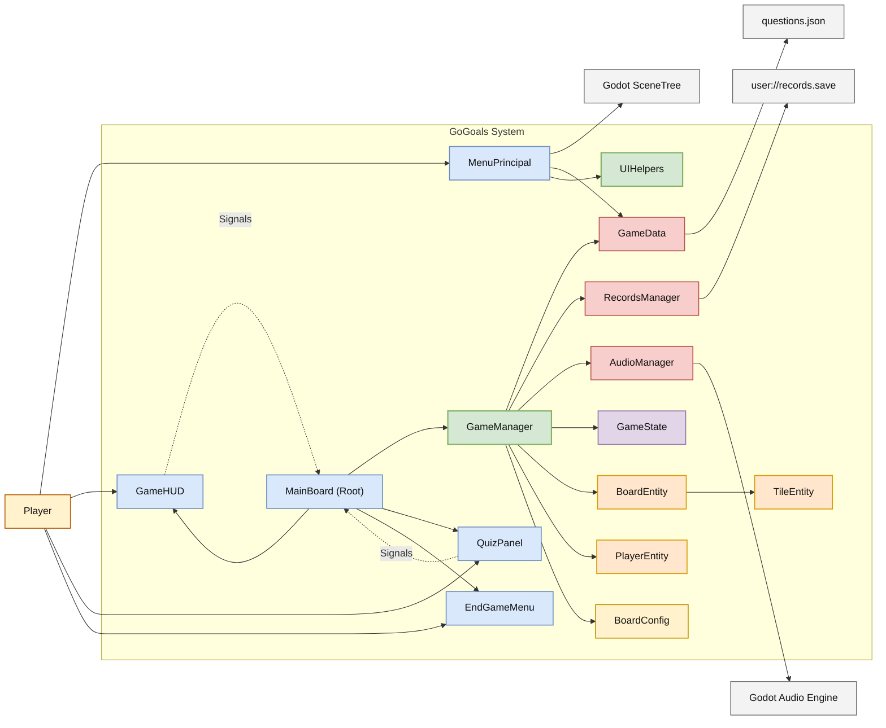

# Architecture Reference

Technical documentation detailing the structural design, component responsibilities, and communication patterns powering the **GoGoals** Godot 4.6 project.

---

## 1. Architectural Pattern

GoGoals implements a **Hierarchical Node-Based Architecture** augmented with global service singletons and central orchestration via the Observer pattern. 

Unlike strict MVC or Clean Architecture, this pattern natively embraces Godot's scene tree paradigms:
*   **Scene-Driven Boundaries:** Scenes are treated as both composition units and presentation layers.
*   **Lightweight Domain Entities:** Nodes like `BoardEntity` and `PlayerEntity` encapsulate local behavior (e.g., path calculations, token offsets) but do not govern the game loop.
*   **Central Application Coordination:** A dedicated orchestrator (`GameManager`) acts as the application service layer, owning the primary use cases.

---

## 2. Core Pillars

### 2.1 Scene Composition Root
Navigation and structure depend entirely on Godot's native scene system. The core gameplay scene (`pantalla_de_juego.tscn`) utilizes a `MainBoard` script acting as a **Composition Root**. 

Upon instantiation, `MainBoard` assembles the presentation layer (HUD, Quiz Panels, Menus), initializes the `GameManager`, and wires all signal contracts between them.

### 2.2 Global Autoload Services
Cross-cutting concerns are managed by three primary Singletons (`/root/ServiceName`):

| Service | Responsibility |
|---------|----------------|
| `GameData` | Loads the `questions.json` bank. Manages category-specific pooling, randomization, and zero-repeat cycling. |
| `AudioManager` | Manages persistent background music (with native auto-loop support) and spawns ephemeral SFX players. Persists volume levels. |
| `RecordsManager` | Handles local storage (`user://records.save`). Sorts leaderboard entries based on turn efficiency and speed. |

### 2.3 Signal-Driven Decoupling
UI components never hold direct references to the `GameManager` or Domain Entities. Instead, communication relies heavily on Godot signals.

*   **Upstream:** UI nodes emit domain-intent signals (e.g., `dice_requested`, `answer_selected`). The `MainBoard` intercepts these and invokes methods on the `GameManager`.
*   **Downstream:** `GameManager` emits state-update signals (e.g., `turn_started`, `quiz_requested`). UI nodes listen to these signals to update their visual state.

### 2.4 State Isolation
Mutable session data is isolated within a dedicated `GameState` resource. This encompasses:
*   Current game phase (`MENU`, `PLAYING`, `PAUSED`, `GAME_OVER`).
*   Active player indices and exact tile positions.
*   Turn counters and dynamically calculated limits (e.g., dynamic finish tile calculations based on absolute board size).

By separating state from the `GameManager`, the project achieves superior testability and simplifies pause/resume logic.

---

## 3. System Context Diagram

---

## 4. Notable Implementation Details

### 4.1 Recursion Protection
Tile resolution handles ladders and slides recursively (e.g., a slide dropping a player onto a ladder). To ensure stability, `GameManager::_check_tile` implements a `MAX_TILE_CHECK_DEPTH` guard. If recursion exceeds 10 iterations, the sequence is forcibly aborted to prevent editor/engine freezes.

### 4.2 UIHelpers Utility
To enforce DRY (Don't Repeat Yourself) principles, repetitive UI logic—such as translating decibel values to percentages for audio sliders, or interacting with the `DisplayServer` to toggle fullscreen/borderless modes—is extracted into a static `UIHelpers` utility class utilized across both the Pause Menu and Options Menu.

### 4.3 Dynamic Scalability
Hardcoded constraints have been minimized. For example:
*   **Camera Constraints:** The camera boundaries actively query `ProjectSettings.get_setting("display/window/size/viewport_width")` rather than relying on hardcoded `1366x766` values.
*   **Victory Tile:** The finish index dynamically scales based on the exact size of the array of tiles provided to the `BoardEntity` during initialization.

---

## 5. Automated Testing

The project implements a lightweight, custom test runner located in `tests/run_tests.gd`. Optimized for headless execution via Godot CLI, it validates core domain logic without requiring a graphical context.

**Key Coverage:**
*   Turn rotation isolation and player indexing.
*   Path calculation accuracy (verifying the "bounce" backward mechanics).
*   Question pooling algorithms (ensuring zero repeats within a cycle).
*   State machine robustness during Pause/Resume transitions.
